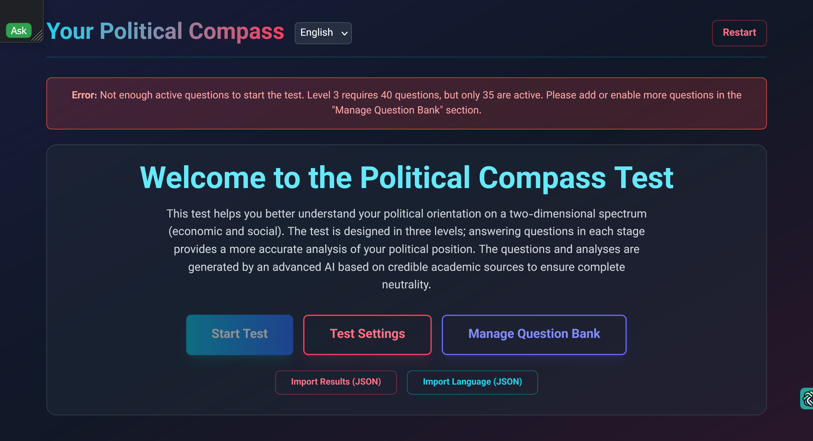

# Your Political Compass

[English Version](#english-version) | [نسخه فارسی](#نسخه-فارسی)

---

## English Version

An interactive web application that determines a user's political orientation through a multi-level quiz, providing detailed analysis and a visual political compass. The questions and analysis are generated by Gemini, based on academic, non-biased sources.

### Screenshots



### Features

*   **AI-Powered Content**: All quiz questions and final analyses are generated by Google's Gemini Pro model, ensuring high-quality, neutral, and academically-grounded content.
*   **Multi-Level Quiz**: The test is structured into three levels. Completing more levels provides a progressively more accurate and nuanced analysis of the user's political stance.
*   **Bilingual Support (English & Persian)**: The entire user interface, including all questions and options, is available in both English and Persian.
*   **Dynamic Language Support**: Users can import custom language files (JSON) to add new translations to the application.
*   **Secure Question Bank Management**: A password-protected admin area allows for full management of the quiz questions. This includes adding, editing, deleting, and enabling/disabling questions for each level.
*   **AI-Assisted Question Generation**: Generate new, high-quality questions directly within the management panel using Gemini.
*   **AI-Powered Validation**: Automatically validate the entire question bank to identify and remove duplicate or irrelevant questions.
*   **Comprehensive Results**: After each level, users receive a detailed analysis, including:
    *   A visual position on the 2D political compass chart.
    *   A summary of their political ideology.
    *   Key behavioral traits.
    *   A comprehensive analysis generated by Gemini.
*   **Export & Share Results**: Users can export their results in multiple formats (Image, JSON, TXT, CSV, DOC, HTML) or share a unique link that carries their result data.

### Local Installation & Setup

This is a static web application with no server-side build step. You can run it by opening the `index.html` file directly in a browser or using a simple local server.

1.  **Clone the Repository:**
    ```bash
    git clone <repository-url>
    cd <repository-folder>
    ```

2.  **Run with a Local Server (Recommended):**
    For the best experience, use a simple HTTP server. If you have Node.js installed, you can use `http-server`:
    ```bash
    # Install http-server globally
    npm install -g http-server

    # Run the server in the project directory
    http-server
    ```
    Then, open your browser to `http://localhost:8080`.

#### API Key Configuration

The application requires a Google Gemini API key to function.

*   **Constraint**: The code is designed to exclusively read the API key from `process.env.API_KEY`, assuming it is injected by the hosting environment.

*   **Local Development Workaround**: Since a browser cannot directly read `process.env`, you must temporarily modify the code for local testing.
    1.  Open the file `services/geminiService.ts`.
    2.  Find the line `const API_KEY = process.env.API_KEY;`.
    3.  Replace it with your actual key: `const API_KEY = 'YOUR_GEMINI_API_KEY_HERE';`.
    4.  **IMPORTANT**: Do **NOT** commit this change to your repository. Exposing your API key publicly is a major security risk. Revert this change before committing your code.

### Deployment

You can deploy this static application to various hosting providers. Here are guides for Cloudflare Pages and GitHub Pages.

#### Cloudflare Pages (Recommended)

Cloudflare Pages is recommended as it allows you to securely store your API key as an environment variable, which is required for the application to work without code modification.

1.  **Push to GitHub**: Make sure your project is on a GitHub repository.
2.  **Create a Cloudflare Pages Project**:
    *   Log in to your [Cloudflare Dashboard](https://dash.cloudflare.com/).
    *   Go to **Workers & Pages** > **Create application** > **Pages** > **Connect to Git**.
    *   Select your project repository.
3.  **Configure Build Settings**:
    *   Since this is a static project, you don't need a build command.
    *   **Framework preset**: None
    *   **Build command**: Leave empty.
    *   **Build output directory**: Leave empty (or set to `/`).
4.  **Set Environment Variable**:
    *   After the project is created, go to its **Settings** > **Environment variables**.
    *   Under **Production**, add a new variable:
        *   **Variable name**: `API_KEY`
        *   **Value**: Enter your Google Gemini API key.
    *   Click **Save**.
5.  **Deploy**: Re-deploy your project for the environment variable to take effect. Cloudflare will securely make this variable available to the application at runtime.

#### GitHub Pages

Deploying on GitHub Pages is simple, but it has a major limitation: it does not support environment variables for client-side code.

1.  **Push to GitHub**: Ensure your code is in a GitHub repository.
2.  **Enable GitHub Pages**:
    *   Go to your repository's **Settings** tab.
    *   Click on **Pages** in the left sidebar.
    *   Under **Build and deployment**, select a **Source** (e.g., `Deploy from a branch`) and choose your main branch.
    *   Save the changes. Your site will be deployed to `https://<your-username>.github.io/<repository-name>/`.
3.  **API Key Warning**:
    *   To make the app work on GitHub Pages, you would have to hardcode your API key in the `services/geminiService.ts` file.
    *   **This is NOT recommended.** It will expose your key to anyone who inspects your site's code, which can lead to abuse and financial costs. If you choose to do this, use a key with strict usage limits and monitor it closely.

---

## نسخه فارسی

یک اپلیکیشن وب تعاملی که گرایش سیاسی کاربر را از طریق یک آزمون چند مرحله‌ای مشخص کرده و تحلیلی دقیق به همراه یک قطب‌نمای سیاسی بصری ارائه می‌دهد. سوالات و تحلیل‌ها توسط هوش مصنوعی Gemini و بر اساس منابع آکادمیک و بی‌طرف تولید شده‌اند.

### تصاویر پیش‌نمایش


### امکانات

*   **محتوای تولید شده با هوش مصنوعی**: تمام سوالات آزمون و تحلیل‌های نهایی توسط مدل Gemini Pro گوگل تولید می‌شوند که محتوایی با کیفیت، بی‌طرف و مبتنی بر اصول آکادمیک را تضمین می‌کند.
*   **آزمون چند مرحله‌ای**: آزمون در سه سطح طراحی شده است. تکمیل مراحل بیشتر، تحلیلی دقیق‌تر و عمیق‌تر از جایگاه سیاسی کاربر ارائه می‌دهد.
*   **پشتیبانی دو زبانه (فارسی و انگلیسی)**: کل رابط کاربری، شامل تمام سوالات و گزینه‌ها، به دو زبان فارسی و انگلیسی در دسترس است.
*   **پشتیبانی از زبان پویا**: کاربران می‌توانند فایل‌های زبان سفارشی (با فرمت JSON) را وارد کرده و ترجمه‌های جدیدی به برنامه اضافه کنند.
*   **مدیریت امن بانک سوالات**: یک بخش مدیریت با رمز عبور امکان کنترل کامل سوالات آزمون را فراهم می‌کند. این بخش شامل افزودن، ویرایش، حذف و فعال/غیرفعال کردن سوالات برای هر مرحله است.
*   **تولید سوال با کمک هوش مصنوعی**: سوالات جدید و با کیفیت را مستقیماً از طریق پنل مدیریت با استفاده از Gemini تولید کنید.
*   **اعتبارسنجی با هوش مصنوعی**: کل بانک سوالات را به صورت خودکار اعتبارسنجی کنید تا سوالات تکراری یا نامرتبط شناسایی و حذف شوند.
*   **نتایج جامع**: پس از هر مرحله، کاربران یک تحلیل دقیق دریافت می‌کنند که شامل موارد زیر است:
    *   نمایش جایگاه بصری در نمودار قطب‌نمای سیاسی دو بعدی.
    *   خلاصه‌ای از ایدئولوژی سیاسی.
    *   ویژگی‌های کلیدی رفتاری.
    *   تحلیلی جامع که توسط Gemini تولید شده است.
*   **خروجی و اشتراک‌گذاری نتایج**: کاربران می‌توانند نتایج خود را در فرمت‌های مختلف (تصویر، JSON، TXT، CSV، DOC، HTML) خروجی بگیرند یا لینکی منحصر به فرد که حاوی داده‌های نتایجشان است را به اشتراک بگذارند.

### نصب و راه‌اندازی محلی

این یک اپلیکیشن وب استاتیک بدون نیاز به مرحله بیلد سمت سرور است. می‌توانید آن را با باز کردن مستقیم فایل `index.html` در مرورگر یا با استفاده از یک سرور محلی ساده اجرا کنید.

۱. **کلون کردن ریپازیتوری:**
    ```bash
    git clone <repository-url>
    cd <repository-folder>
    ```

۲. **اجرا با سرور محلی (توصیه می‌شود):**
   برای بهترین تجربه، از یک سرور HTTP ساده استفاده کنید. اگر Node.js را نصب کرده‌اید، می‌توانید از `http-server` استفاده کنید:
    ```bash
    # نصب http-server به صورت سراسری
    npm install -g http-server

    # اجرای سرور در پوشه پروژه
    http-server
    ```
   سپس، مرورگر خود را به آدرس `http://localhost:8080` باز کنید.

#### تنظیم کلید API

این برنامه برای عملکرد صحیح به یک کلید API گوگل Gemini نیاز دارد.

*   **محدودیت**: کد به گونه‌ای طراحی شده که کلید API را منحصراً از `process.env.API_KEY` می‌خواند، با این فرض که این متغیر توسط محیط میزبانی تزریق می‌شود.

*   **راه‌حل برای توسعه محلی**: از آنجایی که مرورگر نمی‌تواند مستقیماً `process.env` را بخواند، باید برای تست محلی کد را به طور موقت تغییر دهید.
    ۱. فایل `services/geminiService.ts` را باز کنید.
    ۲. خط `const API_KEY = process.env.API_KEY;` را پیدا کنید.
    ۳. آن را با کلید واقعی خود جایگزین کنید: `const API_KEY = 'YOUR_GEMINI_API_KEY_HERE';`.
    ۴. **مهم**: این تغییر را در ریپازیتوری خود کامیت **نکنید**. افشای عمومی کلید API یک خطر امنیتی بزرگ است. قبل از کامیت کردن کد، این تغییر را به حالت اول بازگردانید.

### استقرار (Deployment)

می‌توانید این اپلیکیشن استاتیک را روی سرویس‌های میزبانی مختلف مستقر کنید. در ادامه راهنمای استقرار روی Cloudflare Pages و GitHub Pages آمده است.

#### Cloudflare Pages (توصیه می‌شود)

Cloudflare Pages توصیه می‌شود زیرا به شما امکان می‌دهد کلید API خود را به صورت امن به عنوان یک متغیر محیطی ذخیره کنید، که برای کارکرد برنامه بدون تغییر کد ضروری است.

۱. **ارسال به گیت‌هاب**: مطمئن شوید پروژه شما روی یک ریپازیتوری گیت‌هاب قرار دارد.
۲. **ایجاد پروژه در Cloudflare Pages**:
    *   وارد [داشبورد کلودفلر](https://dash.cloudflare.com/) خود شوید.
    *   به **Workers & Pages** > **Create application** > **Pages** > **Connect to Git** بروید.
    *   ریپازیتوری پروژه خود را انتخاب کنید.
۳. **تنظیمات بیلد**:
    *   از آنجایی که این یک پروژه استاتیک است، به دستور بیلد نیازی ندارید.
    *   **Framework preset**: None
    *   **Build command**: خالی بگذارید.
    *   **Build output directory**: خالی بگذارید (یا `/` را تنظیم کنید).
۴. **تنظیم متغیر محیطی**:
    *   پس از ایجاد پروژه، به **Settings** > **Environment variables** بروید.
    *   در بخش **Production**، یک متغیر جدید اضافه کنید:
        *   **Variable name**: `API_KEY`
        *   **Value**: کلید API گوگل Gemini خود را وارد کنید.
    *   روی **Save** کلیک کنید.
۵. **استقرار**: پروژه خود را مجدداً مستقر کنید تا متغیر محیطی اعمال شود. کلودفلر این متغیر را به صورت امن در زمان اجرا در اختیار برنامه قرار می‌دهد.

#### GitHub Pages

استقرار روی GitHub Pages ساده است، اما یک محدودیت بزرگ دارد: از متغیرهای محیطی برای کد سمت کلاینت پشتیبانی نمی‌کند.

۱. **ارسال به گیت‌هاب**: اطمینان حاصل کنید که کد شما در یک ریپازیتوری گیت‌هاب است.
۲. **فعال‌سازی GitHub Pages**:
    *   به تب **Settings** ریپازیتوری خود بروید.
    *   در نوار کناری سمت چپ روی **Pages** کلیک کنید.
    *   در بخش **Build and deployment**، یک **Source** (مثلاً `Deploy from a branch`) انتخاب کرده و شاخه اصلی خود را برگزینید.
    *   تغییرات را ذخیره کنید. سایت شما روی آدرس `https://<your-username>.github.io/<repository-name>/` مستقر خواهد شد.
۳. **هشدار کلید API**:
    *   برای اینکه برنامه روی GitHub Pages کار کند، باید کلید API خود را مستقیماً در فایل `services/geminiService.ts` وارد کنید (Hardcode کنید).
    *   **این کار توصیه نمی‌شود.** این کار کلید شما را در معرض دید هر کسی که کد سایت شما را بررسی کند قرار می‌دهد، که می‌تواند منجر به سوءاستفاده و هزینه‌های مالی شود. اگر این کار را انتخاب کردید، از کلیدی با محدودیت‌های استفاده شدید استفاده کرده و آن را به دقت زیر نظر داشته باشید.